## TODO

- pdf 生成工具
- mcpserver 测试

# OpenAgent · AI 智能体平台

> 基于 LangChain4j 的多智能体平台。**ReAct 循环 + 工具调用 + RAG 知识库 + MCP 协议 + 流式输出**，把"会答题的聊天机器人"升级成"会规划、会用工具、会查资料的 Agent"。

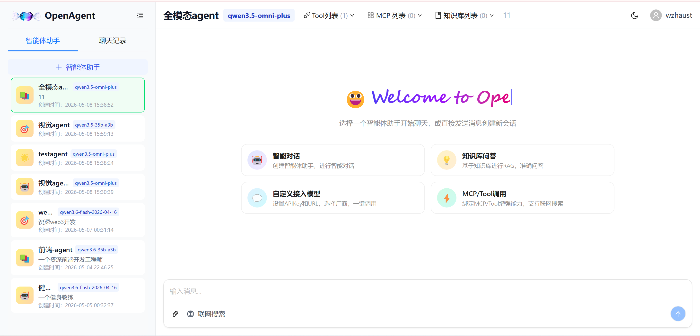

---

## ✨ 核心亮点

| # | 亮点 | 说明 |
|---|---|---|
| 1 | **真正的 Agent Loop**（ReAct / Think-Execute） | 自实现多轮 think→execute 状态机，**禁用** LangChain4j 框架自动 ToolCalling，由后端完全掌控每一步，便于可观测与中断 |
| 2 | **工具系统统一抽象** | 内置工具 + 用户自定义工具 + **MCP 协议工具**统一注册到一个 `LangChainToolExecutor`；同一轮多工具调用并行执行 |
| 3 | **RAG 知识库（PostgreSQL + pgvector）** | 多格式文档（pdf/docx/md/txt/html…）→ Tika 解析 → 智能分块 → embedding 落库 → 向量召回 → 引用回填 |
| 4 | **MCP 协议接入** | 支持配置外部 MCP Server，模型可像调本地工具一样调用 |
| 5 | **多模型动态切换** | 模型表 + 注册表模式，每个智能体可独立绑定 DeepSeek / 通义 / 智谱 / OpenAI 兼容端点 |
| 6 | **SSE 流式输出 + 心跳保活** | Token 级流式渲染、状态实时推送（PLANNING/THINKING/EXECUTING/DONE/ERROR），15s 心跳防代理断连 |
| 7 | **可观测** | 用量计费、消息引用来源、敏感词输入护栏、自动重试、异常 toast |

---

## 🛠️ 技术栈

### 后端
- **Spring Boot 3.5.8** · **Java 17**
- **LangChain4j 1.1**（自定义 Agent Loop，未走框架自动模式）
- **Sa-Token** 认证（双 Token + Redis 持久化）
- **MyBatis-Plus 3.5** + **PostgreSQL 16** + **pgvector**（向量检索）
- **Redis** 会话 / 限流 / 缓存
- **Apache Tika** 文档解析、**Flexmark** Markdown 渲染、**iText** PDF 生成
- **阿里云 OSS** 文件存储
- **Tavily** 联网搜索
- **MCP**（Model Context Protocol）外部工具协议

### 前端
- **React 19** + **TypeScript 5.9** + **Vite (Rolldown)**
- **Ant Design 6** + **@ant-design/x** + **@ant-design/x-markdown**
- **TailwindCSS 4** · **Highlight.js** · **Mermaid** 图表
- **Recharts** 用量可视化、**React Router 7**

---

## 🧠 核心架构图

```
┌──────────────┐   SSE   ┌────────────────────────────────────────┐
│   前端 React  │◄────────│            ChatAgent (ReAct)            │
│   流式渲染    │         │  ┌──────────────────────────────────┐  │
│   工具卡片    │  HTTP   │  │   think  ──▶  execute  ──▶ done  │  │
└──────────────┘────────▶│  │     ▲             │              │  │
                          │  │     └─────────────┘              │  │
                          │  └──────────────────────────────────┘  │
                          │           ▲                            │
                          │           │ ToolSpec / ToolResult       │
                          │           ▼                            │
                          │  ┌─────────────────────────────────┐   │
                          │  │     LangChainToolExecutor       │   │
                          │  ├──── 内置工具（图片/搜索/KB…） │   │
                          │  ├──── @Tool 注解动态注册          │   │
                          │  └──── MCP Client 远程工具          │   │
                          └────────────────────────────────────────┘
                                          │
                            ┌─────────────┼─────────────┐
                            ▼             ▼             ▼
                      ChatModel       PgVector       OSS / Tika
                     (多家模型)       (RAG召回)     (文件入库)
```

---

## 🚀 功能详解

### 1. ReAct Agent Loop（Think-Execute 循环）

每条用户消息会驱动一个完整的 think → execute → … → terminate / directAnswer 循环：

- **think 阶段**：把当前对话上下文 + 工具规格 + 当前时间 + 知识库列表 + 联网搜索提示打包送给 LLM，让模型决定"下一步做什么"
- **execute 阶段**：拿到模型的 tool calls，**多工具并行执行**，结果回写到 chatMemory
- **退出条件**：模型主动调 `directAnswer` / `terminate`，或达到 `MAX_STEPS` 兜底

> 自实现而非用 `@AiService`：因为框架自动模式拿不到中间状态，无法 SSE 实时推送 / 中途打断 / 切换工具子集 / 注入动态 prompt。

### 2. 工具系统

- 工具按角色分为 `FIXED`（必带：directAnswer、terminate、searchKb）和 `OPTIONAL`（按 agent 配置：webSearch、qwenGenerateImage 等）
- 每个 `@Tool` 方法运行时被反射注册到 `invokerByToolName`，参数支持 `@P` 描述自动写入 JSON Schema
- 同一轮 multi-tool call 走 `CompletableFuture` 并行，按请求顺序回填结果，**不会破坏 toolCall ↔ toolResult 配对**

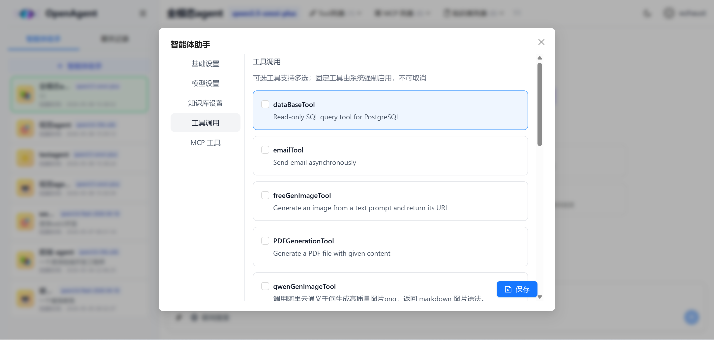

### 3. RAG 知识库

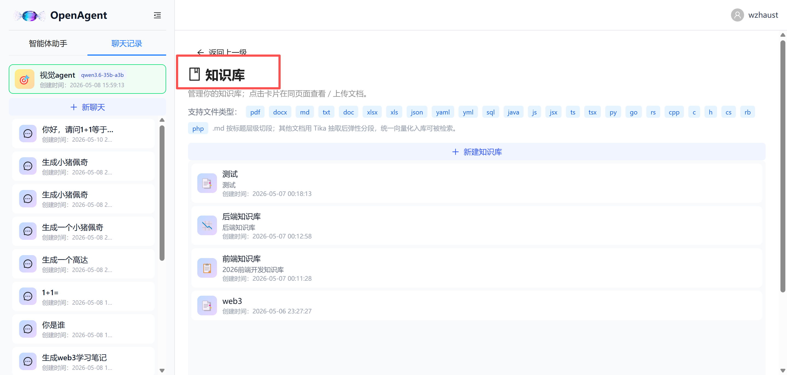

文档处理链路：

```
上传 → OSS 持久化 → Tika 解析 → TextChunker 分块 → 
Embedding 模型向量化 → PostgreSQL + pgvector 落库 → 
ivfflat 索引（10w+ 向量秒级召回）
```

检索阶段：

- 用户提问 → 模型决定调用 `KnowledgeTool(kbsId, query)` → 余弦相似度召回 top-k → 结果回写 chatMemory → 模型组织答案 → 自动把命中的 chunk 作为 `sources` 回填到消息上

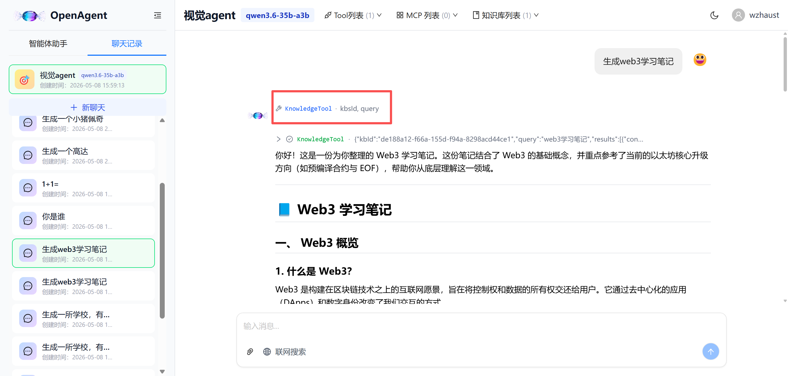

### 4. MCP 协议接入

支持挂载外部 MCP Server。每个 agent 可独立绑定 N 个 MCP，平台会：

1. 启动时建立 MCP Client 连接（HTTP / stdio）
2. `client.listTools()` 拉远程工具规格
3. 把规格合并进当前 agent 的 toolSpecs，**模型完全无感知**
4. 命中调用时自动 `client.executeTool(req)` 转发

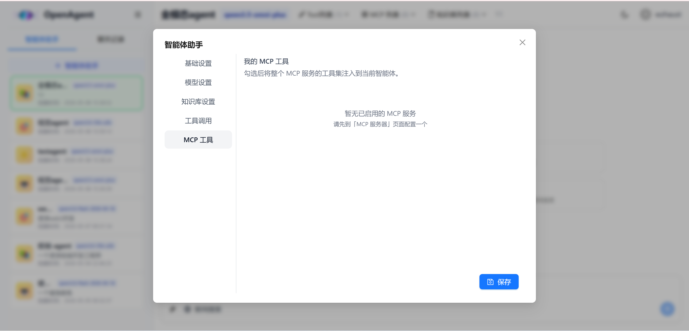

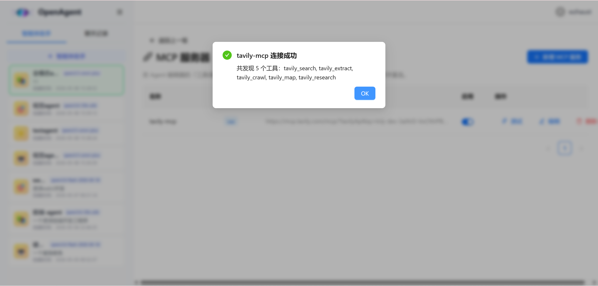

### 5. 文件理解

聊天附件 / 知识库统一走 Tika：pdf / docx / pptx / xlsx / md / html / txt 全支持。前端拖拽即上传、消息内一行展示。

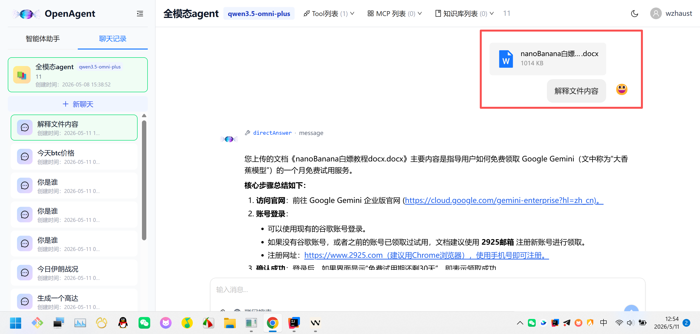

### 6. 联网搜索（Tavily）

按消息粒度开关。开启时：

- think prompt 注入 "用户已开启联网搜索，遇到时效性、新闻、最新数据等问题**必须**调用 webSearch"
- 模型选择是否调用，结果会被作为 `sources` 引用块展示

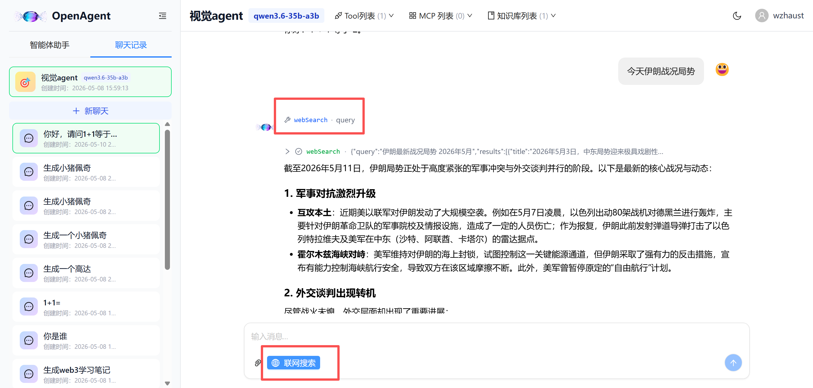

### 7. 文生图

接入通义万相 / qwen-image，模型会通过 `qwenGenerateImage` 工具触发，生成的图直链由前端原生 markdown 图片块渲染。

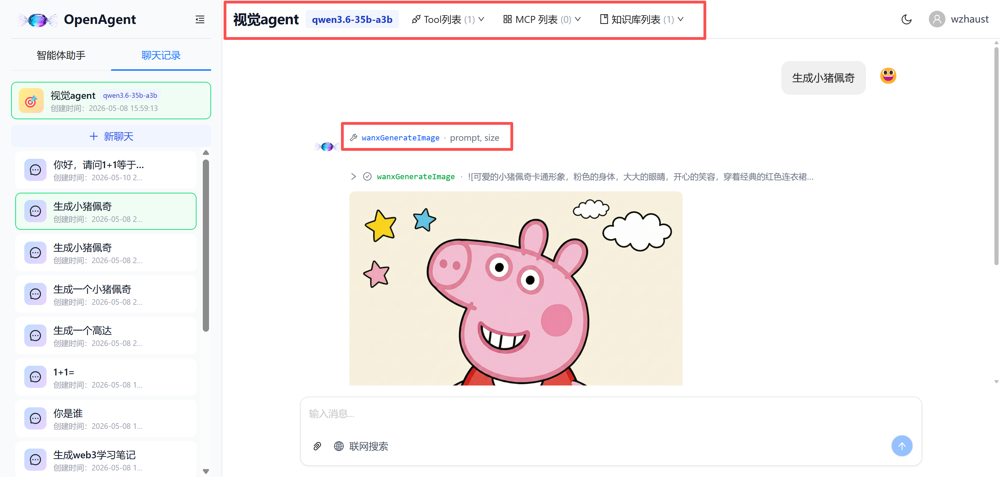

### 8. 自定义模型 / 多模型切换

后台可添加 OpenAI 兼容端点（DeepSeek / 通义 / 智谱 / 自部署 Ollama 等），并按 agent 绑定。

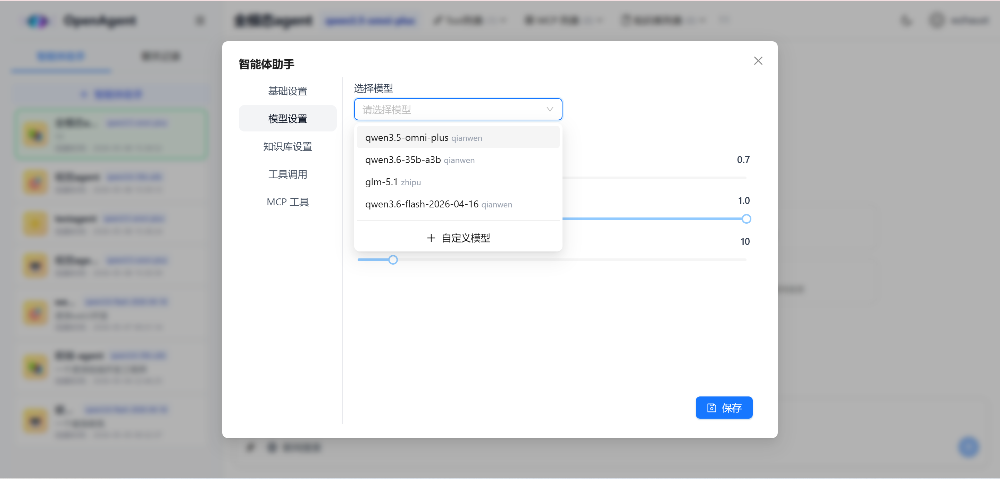

### 9. 智能体管理 + 会话分享

每个用户可创建多个 agent，配置 systemPrompt、模型、工具、知识库、MCP；会话支持分享只读链接。

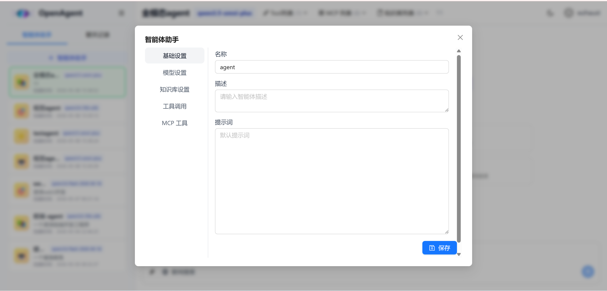
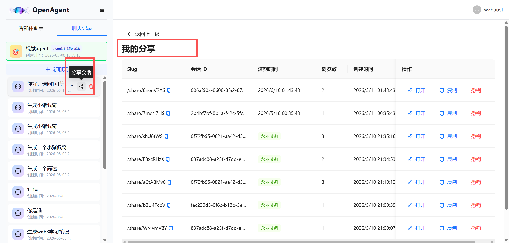

### 10. 用量统计

按用户 × 模型粒度统计 token / 调用次数，提供可视化看板。

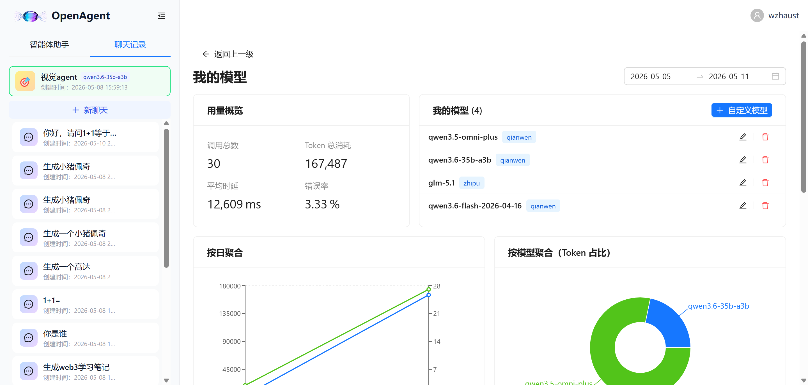
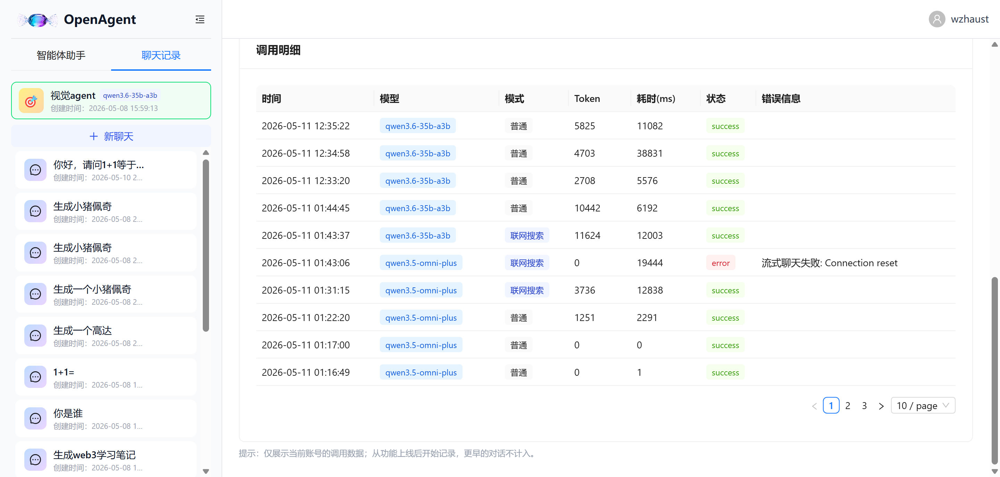

### 11. 消息反馈 / 编辑 / 重试

每条 AI 消息支持复制、点赞 / 点踩反馈、引用来源跳转、删除、重新生成。

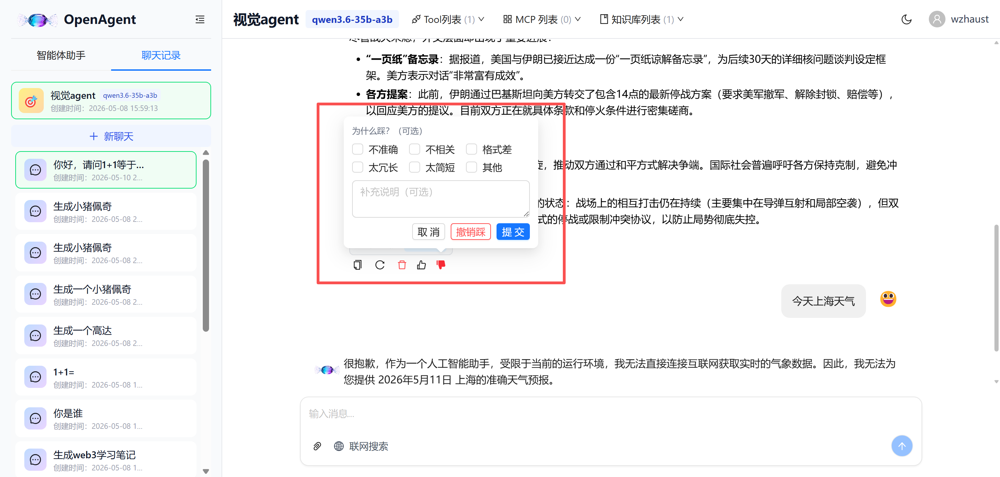

---

## 🔒 稳定性与生产级细节

| 维度 | 实现 |
|---|---|
| **敏感词输入护栏** | 自定义 `InputGuardrail`，子串包含匹配；用 `PathMatchingResourcePatternResolver` 加载 classpath 词库（兼容 jar 部署） |
| **流式抖动重试** | `streamChat` 对 `Connection reset` / `SocketTimeout` 指数退避重试 2 次 |
| **SSE 心跳** | 后端每 15s `:hb` 注释行，防 Nginx / 浏览器 idle 超时 |
| **异常友好提示** | Agent 运行失败 → SSE 推 `AI_ERROR` 类型 → 前端 toast，避免静默卡死 |
| **Token 续签** | sa-token `auto-renew` + `active-timeout 3h` + `timeout 7d`，活跃用户无感续期 |
| **用户操作可中断** | StopRegistry：用户可一键停止正在运行的 Agent |

---

## 🏃 快速开始

提供两种部署方式：**本地开发启动**（无需 Docker，开发调试）与 **Docker Compose 一键部署**（云服务器、演示环境）。

---

### 方式一：本地启动（开发）

#### 环境依赖
- JDK 17 + Maven 3.9+
- Node.js 20+
- npm
- PostgreSQL 16 + **pgvector 扩展**
- Redis 7+

#### 步骤

1. **数据库准备**：手动建库 `openagent`，执行 `openagent.sql`，启用 pgvector 扩展，建表。

2. **后端配置**：在 `src/main/resources/` 下创建 `application.yaml`填写数据库、redis、oss、大模型等信息：

3. **启动后端**

4. **启动前端**：
   ```powershell
   cd openagent-fronted
   npm install
   npm run dev
   ```

访问 `http://localhost:5173`，后端 API 在 `http://localhost:8080`。

---

### 方式二：Docker Compose 一键部署（推荐）

#### 环境依赖
- Docker 24+ · Docker Compose v2

#### 步骤

1. **配置环境变量**：
   ```bash
   cp .env.example .env
   vim .env   # 填入数据库密码、LLM Key、前端端口
   ```

2. **一键启动**（首次会自动建表 + 启用 pgvector）：
   ```bash
   docker compose up -d --build
   ```

3. **查看状态 / 日志**：
   ```bash
   docker compose ps
   docker compose logs -f backend
   ```

4. **访问**：浏览器打开 `http://<服务器IP>:${FRONTEND_PORT}`（默认 80）。

> **自动建表机制**：`src/main/resources/openagent.sql` 直接挂到容器 `/docker-entrypoint-initdb.d/`，
> postgres 首次启动时 entrypoint 会以默认的 `postgres` 库连入并执行该 SQL，
> 由 SQL 自身的 `CREATE DATABASE openagent;` + `\connect openagent;` + `CREATE EXTENSION vector;` 完成建库 / 启用扩展 / 建表。
> 本地开发与 Docker 部署 **共用同一份 SQL**，不会出现 schema 漂移。

#### 常用维护命令

```bash
# 代码改动后重新构建 backend
docker compose up -d --build backend

# 重启前端
docker compose restart frontend

# 进入 PostgreSQL
docker exec -it openagent-postgres psql -U openagent

# 备份数据库
docker exec openagent-postgres pg_dump -U openagent openagent > backup.sql

# 彻底清理（会删除数据卷，谨慎）
docker compose down -v
```

#### 生产环境建议

- **HTTPS**：前端 nginx 前再套一层 Caddy / Traefik 自动签证书
- **Cookie 安全**：HTTPS 下在 `.env` 增加 `SA_TOKEN_COOKIE_SECURE=true` 并设 `SAME_SITE=None`
- **资源限制**：在 `docker-compose.yml` 每个服务加 `deploy.resources.limits`
- **监控**：挂 Prometheus 采 JVM / PG / Redis 指标

---

## 📁 目录结构

```
OpenAgent/
├── src/main/java/com/qingqiu/openagent/
│   ├── agent/                # ChatAgent / Factory / 工具 / Guardrail
│   │   ├── tools/            # 内置工具：webSearch, KB, 生图, directAnswer …
│   │   └── guardrail/        # 输入护栏（敏感词等）
│   ├── controller/           # REST API
│   ├── service/              # 业务服务（含 RAG / SSE / MCP / Embedding…）
│   ├── event/                # ChatEvent + 异步监听
│   ├── model/                # entity / dto / vo / request / response
│   └── mapper/               # MyBatis-Plus
├── src/main/resources/
│   ├── application.yaml
│   └── sensitiveLexicon/     # 敏感词词库
├── openagent-fronted/        # React 前端（含 Dockerfile + nginx.conf）
├── asset/                    # 文档截图
├── Dockerfile                # 后端镜像
├── docker-compose.yml        # 一键部署编排
└── .env.example              # 环境变量模板
```

---

## 📜 License

毕业设计项目 · 仅供学习交流

